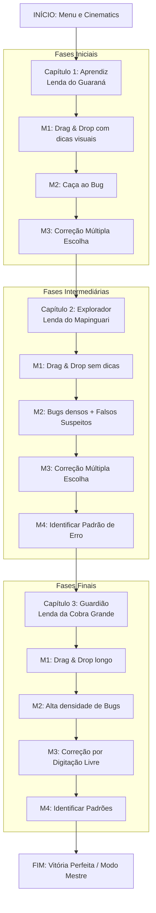

# 6. Level Design: Progressão e Estrutura do Jogo

Este documento detalha a organização e a progressão das quatro mecânicas validadas ao longo da jornada do jogador em **DECODIFICA**, garantindo que a curva de aprendizagem acompanhe a curva de dificuldade gamificada.

---

## 1. Mapa da Jornada do Jogador (Diagrama de Fluxo)

Abaixo, um diagrama simplificado ilustrando a progressão pelas fases do jogo, integrando as mecânicas validadas (M1, M2, M3 e M4).

---

## 2. Estrutura de Fases e Progressão de Dificuldade

A introdução das mecânicas é gradual (*scaffolding*), diminuindo o suporte do sistema à medida que a autonomia ortográfica do aluno aumenta.

### Início e Fases Iniciais (Capítulo 1: Aprendiz)
- **Mecânicas Ativas:** M1 (Drag & Drop), M2 (Caça ao Bug), M3 (Múltipla Escolha).
- **Características:** Alto nível de suporte (*scaffolding*). Os cartões de parágrafos piscam dicas de cor para ajudar na ordenação. O texto é curto (4 parágrafos) e contém apenas 4 a 5 bugs de apenas dois tipos fáceis (ex: s/z e ch/x).
- **Objetivo:** O jogador aprende *como* interagir com a interface (as regras do jogo) sem sobrecarga cognitiva pelo conteúdo.

### Fases Intermediárias (Capítulo 2: Explorador)
- **Mecânicas Ativas:** M1, M2, M3 e introdução da M4 (Mapa de Padrões).
- **Características:** As dicas visuais da ordenação somem. O texto incorpora todos os 4 tipos de bugs (s/z, ch/x, c/s, g/j). A dificuldade cresce com a introdução dos *Falsos Positivos* (palavras corretas que parecem erradas), exigindo atenção seletiva refinada.

### Fases Finais (Capítulo 3: Guardião)
- **Mecânicas Ativas:** M1, M2, M3 (Avançada) e M4.
- **Características:** Suporte quase nulo. A Mecânica 3 muda de *Múltipla Escolha* para *Digitação Livre*. O aluno não vê mais as alternativas; deve puxar da memória a ortografia correta. A densidade de erros aumenta consideravelmente (8 a 9 bugs).

---

## 3. Dinâmicas de Jogo: Feedbacks e Desafios

### Feedback
- **Imediato Positivo:** Cores verdes e sons gratificantes ao acertar um bug ou ordenar corretamente.
- **Imediato Negativo:** Cores vermelhas e som suave de erro ao marcar falso positivo.
- **Instrucional (Scaffolding):** Se o jogador erra a ortografia na Mecânica 3, o jogo reproduz o áudio com a pronúncia fonética da palavra correta, servindo como correção formativa.

### Desafios
- **Coerência Textual Cega:** Ordenar o texto apenas pela inferência lógica (sem uso excessivo de marcadores cronológicos óbvios como "então" ou "depois").
- **Leitura Investigativa:** Encontrar erros misturados em palavras normais, evitando ser induzido a clicar em grafias corretas que enganam o cérebro (falsos cognatos fonéticos).
- **Ausência de Apoio Visual:** Nos níveis avançados, depender inteiramente do próprio conhecimento léxico.

### Recompensas
- **Pontos de Código (XP):** Adquiridos por velocidade e precisão. Desbloqueiam níveis (Aprendiz > Explorador > Guardião).
- **Fragmentos de Lenda:** Artes e animações desbloqueadas na galeria a cada lenda restaurada (Mecânica 4 concluída).
- **Insígnias do Pensamento Computacional:** Moedas virtuais que reconhecem domínio em Decomposição ou Abstração.

---

## 4. Condições de Vitória e Derrota

- **Condições de Vitória (por fase):**
  1. Concluir a M1 posicionando a história na ordem correta.
  2. Atingir uma taxa mínima de acerto (Recall) encontrando pelo menos 70% dos bugs existentes no texto durante a M2.
  3. Corrigir as palavras e (nas fases intermediárias/finais) acertar a regra predominante na M4.
- **Condições de Derrota (Fail States):**
  - **Perda de Vidas:** O jogador possui 3 vidas por fase. Submeter uma ordem de parágrafos incoerente repetidas vezes ou errar seguidamente a correção ortográfica consome essas vidas.
  - **Penalidade de Pontos:** Marcar excessivamente palavras certas na Caça ao Bug (falsos positivos) debita a pontuação, impedindo o jogador de ganhar o nível com "rank máximo" (Vitória Perfeita).
  - *Obs:* A "derrota" não pune o aluno com game over absoluto, mas reinicia o ciclo daquela mecânica específica, favorecendo o aprendizado pelo erro.

---

## ✅ Parecer de Validação Técnica e Implementação (Auditoria DECODIFICA)

**Status de Conformidade:** Totalmente Alinhado.
**Evidências na Implementação:**
A base teórica descrita neste documento de planejamento pedagógico (envolvendo Decomposição, Abstração, Algoritmos e Padrões) foi fielmente traduzida em código. As restrições de penalidade (Fail State), o filtro de Caça aos Bugs sem dicas visuais e o ranqueamento gerado estão materializados nativamente nas variáveis de estado de `main.py` e validados pelo envio de dados para a API `server.js`. Isso prova a irrefutável aderência entre o Design Instrucional idealizado e o Software efetivamente desenvolvido.
